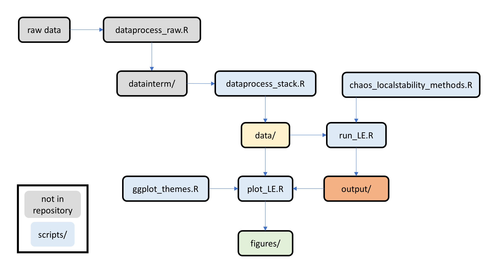

# Intermittent instability in plankton

This repository is associated with the paper "Intermittent instability is widespread in plankton communities" by Tanya Rogers, Stephan Munch, Shin-ichiro Matsuzaki, and Celia Symons published in *Ecology Letters* (2023).

To comply with data licensing polices, the abundance and temperature time series for some datasets are omitted, but can be obtained from the sources cited. The directory `data_public/` contains the abundance and temperature series for which redistribution is allowed (these data have been cleaned, processed, summarized to different levels of aggregation, and filtered using critera for zeros and missing values), and the metadata for all series. Analysis outputs for all series are included in `outputs/`. Users can substitute `data_public/` for `data/` in the scripts to reproduce most of the results. Note that figures reliant on abundance data will not be exactly reproduced due to the omissions. 

Reuse of the **source data** in this repository should cite both the original source(s) and this study, and comply with the original license terms for each dataset. The **code and derived outputs** in this repository were developed by US government employees, and are considered public domain.

### Data sources

**Loch Leven**

Contains data supplied by UK Centre for Ecology & Hydrology.

Gunn, I.D.M.; George, D.G.; Johnson, D.; Jones, D.H.; May, L. (2015). Crustacean zooplankton data from Loch Leven, 1972-2007 NERC Environmental Information Data Centre. https://doi.org/10.5285/014f1c48-0838-49ca-b059-f084b13f4d5f 

Dudley, B. J.; May, L.; Spears, B. M.; Kirika, A. (2013). Loch Leven long-term monitoring data: phosphorus, silica and chlorophyll concentrations, water clarity and temperature, 1985-2007 NERC Environmental Information Data Centre. https://doi.org/10.5285/2969776d-0b59-4435-a746-da50b8fd62a3 

**Blelham Tarn, Windermere North, Esthwaite Water**

Thackeray, S.J.; De Ville, M.M.; Fletcher, J.M.; James, J.B.; Maberly, S.C.; Mackay, E.B.; Winfield, I.J. (2015). Cumbrian Lakes plankton and fish data (1940 to 2013). NERC Environmental Information Data Centre. (Dataset). https://doi.org/10.5285/1de49dab-c36e-4700-8b15-93a639ae4d55 

Maberly, S.C.; Brierley, B.; Carter, H.T.; Clarke, M.A.; De Ville, M.M.; Fletcher, J.M.; James, J.B.; Keenan, P.; Kelly, J.L.; Mackay, E.B.; Parker, J.E.; Patel, M.; Pereira, M.G.; Rhodes, G.; Tanna, B.; Thackeray, S.J.; Vincent, C.; Feuchtmayr, H. (2017). Surface temperature, surface oxygen, water clarity, water chemistry and phytoplankton chlorophyll a data from Blelham Tarn, 1945 to 2013. NERC Environmental Information Data Centre. (Dataset). https://doi.org/10.5285/393a5946-8a22-4350-80f3-a60d753beb00  

Maberly, S.C.; Brierley, B.; Carter, H.T.; Clarke, M.A.; De Ville, M.M.; Fletcher, J.M.; James, J.B.; Keenan, P.; Kelly, J.L.; Mackay, E.B.; Parker, J.E.; Patel, M.; Pereira, M.G.; Rhodes, G.; Tanna, B.; Thackeray, S.J.; Vincent, C.J.; Feuchtmayr, H. (2017). Surface temperature, surface oxygen, water clarity, water chemistry and phytoplankton chlorophyll a data from Windermere North Basin, 1945 to 2013. NERC Environmental Information Data Centre. (Dataset). https://doi.org/10.5285/f385b60a-2a6b-432e-aadd-a9690415a0ca 

Maberly, S.C.; Brierley, B.; Carter, H.T.; Clarke, M.A.; De Ville, M.M.; Fletcher, J.M.; James, J.B.; Keenan, P.; Kelly, J.L.; Mackay, E.B.; Parker, J.E.; Patel, M.; Pereira, M.G.; Rhodes, G.; Tanna, B.; Thackeray, S.J.; Vincent, C.; Feuchtmayr, H. (2017). Surface temperature, surface oxygen, water clarity, water chemistry and phytoplankton chlorophyll a data from Esthwaite Water, 1945 to 2013. NERC Environmental Information Data Centre. (Dataset). https://doi.org/10.5285/87360d1a-85d9-4a4e-b9ac-e315977a52d3 

**Lake Müggelsee**

Müggelsee long-term research programme of the Leibniz Institute of Freshwater Ecology and Inland Fisheries (IGB), data provided by Rita Adrian

**Lake Greifensee**

Thomas, M.K.; Fontana, S.; Reyes, M.; Kehoe, M.; Pomati, F. (2019). Data from: The predictability of a lake phytoplankton community, over time-scales of hours to years, Dryad, Dataset, https://doi.org/10.5061/dryad.r4454 

**Lake Zurich**

Wasserversorgung Zürich

**Lake Geneva**

Rimet F, Anneville O, Barbet D, Chardon C, Crépin L, Domaizon I, Dorioz J-M, Espinat L, Frossard V, Guillard J, Goulon C, Hamelet V, Hustache J-C, Jacquet S, Lainé L, Montuelle B, Perney P, Quetin P, Rasconi S, Schellenberger A, Tran-Khac V, Monet G. (2020) The Observatory on LAkes (OLA) database: Sixty years of environmental data accessible to the public. J Limnol. 79. https://doi.org/10.4081/jlimnol.2020.1944 © SOERE OLA-IS, AnaEE-France, INRA of Thonon-les-Bains, CIPEL, Dec 19 2019, developed by the Eco-Informatique ORE system of the INRA.

**Lake Mendota**

Lathrop, R. 2022. Madison Wisconsin Lakes Zooplankton 1976 - 1994 ver 3. Environmental Data Initiative. https://doi.org/10.6073/pasta/cc7eb937d181b78ae4635d743a09fdc7 

Magnuson, J., S. Carpenter, and E. Stanley. 2019. North Temperate Lakes LTER: Zooplankton - Madison Lakes Area 1997 - current ver 31. Environmental Data Initiative. https://doi.org/10.6073/pasta/8b265c0300252c87805f26f41e174aa4 

Robertson, D. 2022. Lake Mendota water temperature secchi depth snow depth ice thickness and meteorological conditions 1894 - 2007 ver 2. Environmental Data Initiative. https://doi.org/10.6073/pasta/3ec7803e1b1c33d34abacb049e95f2e3 

Magnuson, J., S. Carpenter, and E. Stanley. 2020. North Temperate Lakes LTER: High Frequency Water Temperature Data - Lake Mendota Buoy 2006 - current ver 29. Environmental Data Initiative. https://doi.org/10.6073/pasta/8ceff296ad68fa8da6787076e0a5d992 

**Lake Kasumigaura**

Matsuzaki, S.S., Suzuki, K., Kadoya, T., Nakagawa, M., & Takamura, N. (2018). Bottom‐up linkages between primary production, zooplankton, and fish in a shallow, hypereutrophic lake. Ecology, 99(9), 2025-2036. http://db.cger.nies.go.jp/gem/moni-e/inter/GEMS/database/kasumi/index.html 

**Yale Lake, Lake Griffin, Lake Eustis, Lake Dora, Lake Harris, Lake Beauclair, Lake Apopka**

St. Johns River Water Management District. https://www.sjrwmd.com/ 

**North Sea**

Continuous Plankton Recorder Survey, Marine Biological Association of the UK.

Boyin Huang, Peter W. Thorne, Viva F. Banzon, Tim Boyer, Gennady Chepurin, Jay H. Lawrimore, Matthew J. Menne, Thomas M. Smith, Russell S. Vose, and Huai-Min Zhang (2017): NOAA Extended Reconstructed Sea Surface Temperature (ERSST), Version 5. NOAA National Centers for Environmental Information. https://doi.org/10.7289/V5T72FNM [9 May 2022]

**Wadden Sea**

Martens, P. (2007): Abundance of zooplankton at times series station List Reede in 1999-2006. Alfred Wegener Institute - Wadden Sea Station Sylt, PANGAEA, https://doi.org/10.1594/PANGAEA.646280; https://doi.org/10.1594/PANGAEA.646281; https://doi.org/10.1594/PANGAEA.646282; https://doi.org/10.1594/PANGAEA.646283; https://doi.org/10.1594/PANGAEA.646284; https://doi.org/10.1594/PANGAEA.646285; https://doi.org/10.1594/PANGAEA.646286; https://doi.org/10.1594/PANGAEA.646287

Martens, Peter (2011): Abundance of zooplankton at times series station List Reede in 2007-2008. Alfred Wegener Institute - Wadden Sea Station Sylt, PANGAEA, https://doi.org/10.1594/PANGAEA.756061; https://doi.org/10.1594/PANGAEA.756062

van Beusekom, Justus (2010): Hydrochemistry time series at station List Reede in 1999-2007. Alfred Wegener Institute - Wadden Sea Station Sylt, PANGAEA 
https://doi.org/10.1594/PANGAEA.745142; https://doi.org/10.1594/PANGAEA.745143; https://doi.org/10.1594/PANGAEA.745144; https://doi.org/10.1594/PANGAEA.745145; https://doi.org/10.1594/PANGAEA.745146; https://doi.org/10.1594/PANGAEA.745147; https://doi.org/10.1594/PANGAEA.745148; https://doi.org/10.1594/PANGAEA.745149; https://doi.org/10.1594/PANGAEA.745150; https://doi.org/10.1594/PANGAEA.745151

**Port Erin Bay**

Johnstone, J., Scott, A. and Chadwick, H.C., 1924. The marine plankton, with special reference to investigations made at Port Erin, Isle of Man during 1907-1914. Liverpool U.P & Hodder and Stoughton Ltd., London

Boyin Huang, Peter W. Thorne, Viva F. Banzon, Tim Boyer, Gennady Chepurin, Jay H. Lawrimore, Matthew J. Menne, Thomas M. Smith, Russell S. Vose, and Huai-Min Zhang (2017): NOAA Extended Reconstructed Sea Surface Temperature (ERSST), Version 5. NOAA National Centers for Environmental Information. https://doi.org/10.7289/V5T72FNM [9 May 2022]

**Narragansett Bay**

Smayda, T.J. & the Bunker C community (1959-1997). Narragansett Bay Plankton Time Series. Graduate School of Oceanography, URI. https://www.nabats.org/
